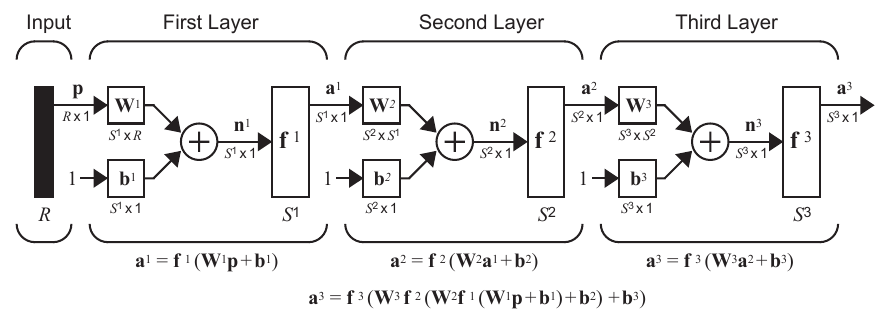
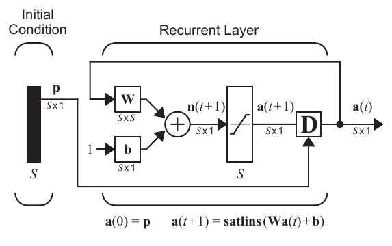
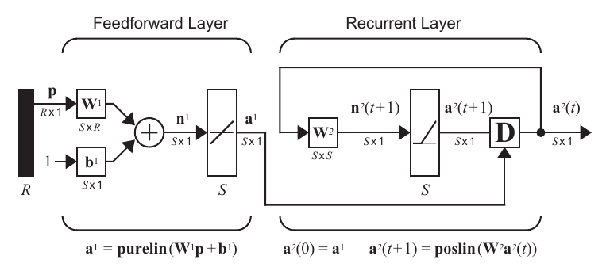

# Red Hamming
## Marco teórico

Antes de comenzar, tocaremos dos conceptos importantes: red feedforward y red recurrente.

### RNA feedforward

Una RNA feedforward (propagación hacia adelante) si sus conexiones van exclusivamente en un sentido, van de las entradas hacia las alidas, pero no se dirigen hacia atrás, arriba ni abajo. No tiene autoconexiones pero puede tener más de una capa de conexión. Otra característica que distigue esta red es que sus capas pueden dividirse en tres partes principales, las cuales son la capa de entrada, dónde se reciben los datos a procesar; la capa intermedia, donde se da el procesamiento de la información y la capa de salida. El diagrama en forma matricial se puede apreciar a continuación:

Cómo se puede notar, la salida de la primera capa es la entrada de la segunda y así sucesivamente; si es que tenemos $n$ capas, será lo mismo con cada una de las capas siguientes, con su función correspondiente.

### RNA recurrente

En un red recurrente se necesita de un bloque llamado "retraso en tiempo", el cuál es la condición inicial para la red. Se caraccterizan porque se crean bucles en las neuronas de la red, esto mediante el uso de las conexiones recurrentes, pudiendo aparecer en la red conexiones de una nuerona a ella misma, conexiones entre neuronas de una misma capa o conexiones de las neuronas de una capa a la capa anterior. La consideración de conexiones recurrentes en una red implica un aumento del número de pesos o parámetros ajustables en la red, lo cual permite que aumente la capacidad de representación. El diagrama en forma matricial es el siguiente:

### RNA Hamming

Una Red Neuronal Artificial hamming es una red "competitiva"; está diseñada explícitamente para resolver problemas de reconocimiento binario de patrones, entonces, podemos decir que esta red nos puede ayudar a clasificar a más de una clase. Esta red neuronal está constituida por dos capas, una capa es de una red tipo feedforward y la otra es de una red recurrente, como se muestra a continuación:

**Capa feedforward**

Esta capa calcula la correlación o producto interno entre cada uno de los vectores prototipo y el patrón de entrada. Con este objetivo, las filas de la matriz de pesos $W^1$, serán cada uno de los vectores prototipo. La ecuación que describe esta capa es:

$$a^1 = purelin(W^1p + b^1)$$

**Capa recurrente**

Las neuronas de esta capa se inicializan con las salidas de la capa feedforward. En esta capa las neuronas compiten entre ellas para determinar a la ganadora. Al final de la competencia, sólo una neurona de esta capa tendrá un valor diferente de cero. La neurona ganadora indica a que clase pertenece el vector de entrada. Las ecuaciones que describen esta capa son:

$$a^2(0) = a^1$$
$$a^2(t +1) = poslin(W^2a^2(t))$$

Y la nueva matriz de pesos tiene la siguiente forma:

$$
W^2 = 
\begin{bmatrix}
1 & -\epsilon\\
-\epsilon & 1
\end{bmatrix}
$$

Dónde el valor de épsilon ($\epsilon$) es un valor menor a $\frac{1}{s - 1}$. Si la matriz es más grande, se pone el valor de uno en la diagonal principal y $-\epsilon$ en las demás posiciones.

## Referencias
- Isasi Biñuela, P.; Galván León, I. M., Redes de neuronas artificiales. Un enfoque práctico, Pearson, Madrid, 2004.